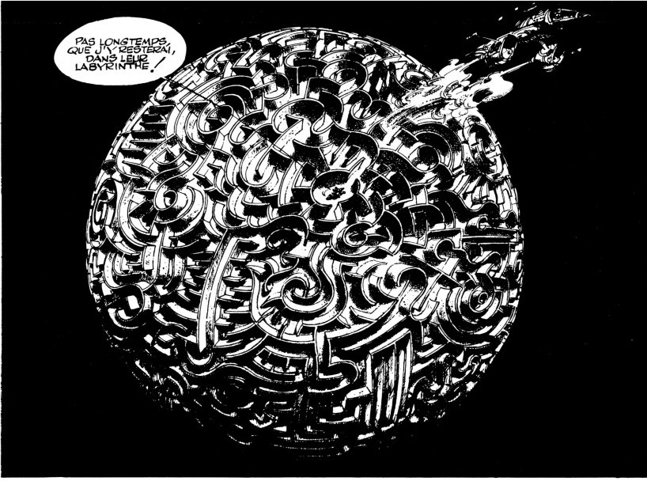

Within the InFluX lab, our research group focus his activities on the fundamental understanding of *soft matter* through experiments, simulations and statistical physics, on *Self-organization* from geometrically constrained sheets, rods, ribbons, shells and the *biomechanics* of living organisms. 

I like the idea that Research is a kind of labyrinth, but unlike the labyrinth-jail proposed here by Franquin (excerpt from *“idées noires”*), researchers build their labyrinth by themselves !

***
*“There’s no sense in being precise when you don’t even know what you’re talking about”*

(John Von Neumann)
***

Phone Office: +32 (0) 65 373819

Office: 1-062, 1st Floor, Mendeleev Building, campus Plaine de Nimy ([see access map](https://web.umons.ac.be/fr/plan-des-campus/){:target="_blank"})

